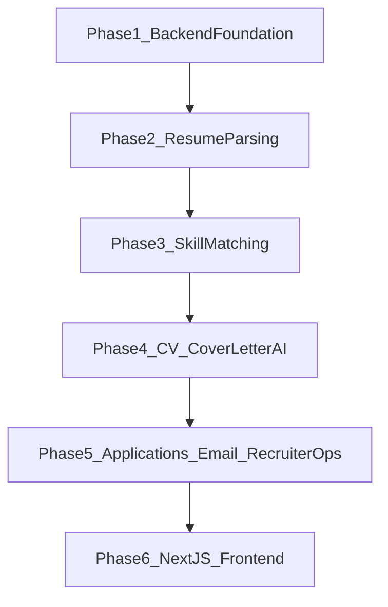

# HireBee Phased Implementation Plan

## Phase Strategy
- Build and verify one phase at a time, with runnable code at the end of each phase.
- Keep API contracts and schema stable early so later AI/frontend work layers cleanly.
- Avoid Alembic; initialize tables at startup via `Base.metadata.create_all(bind=engine)`.

## Phase 1 (Current): Backend Foundation
- Create backend app skeleton under [backend/](backend/) with modular packages:
  - [backend/app/main.py](backend/app/main.py)
  - [backend/app/core/config.py](backend/app/core/config.py)
  - [backend/app/core/security.py](backend/app/core/security.py)
  - [backend/app/db/database.py](backend/app/db/database.py)
  - [backend/app/db/init_db.py](backend/app/db/init_db.py)
- Implement SQLAlchemy models for core entities in [backend/app/models/](backend/app/models/) aligned with required tables: Users, Recruiters, Jobs, JobSkills, CandidateSkills, Applications, Resumes, GeneratedCVs, CoverLetters, Emails, InterviewSchedules.
- Build JWT auth + role-based access (job seeker, recruiter, admin):
  - register/login endpoints
  - profile endpoint for authenticated users
  - admin-only user/recruiter management stubs
- Add Pydantic schemas and validation for auth + base entities in [backend/app/schemas/](backend/app/schemas/).
- Add initial API routers in [backend/app/api/v1/](backend/app/api/v1/) and wire them in [backend/app/main.py](backend/app/main.py).
- Add startup DB initialization in [backend/app/db/init_db.py](backend/app/db/init_db.py) and invoke during FastAPI startup.
- Add production-ready project basics:
  - environment config (`.env.example`)
  - dependency files
  - health endpoint
  - error handling baseline

## Phase 2: Resume Upload & Parsing Pipeline
- Implement file upload/storage endpoints (PDF/DOCX) in [backend/app/api/v1/resumes.py](backend/app/api/v1/resumes.py).
- Build parsing service in [backend/app/services/resume_parser/](backend/app/services/resume_parser/):
  - PyMuPDF PDF extraction
  - python-docx DOCX extraction
  - regex extraction (email, phone, LinkedIn, GitHub)
  - spaCy NER extraction (name/org/date/education/experience)
  - rule-based skill extraction + normalization taxonomy
  - section detection and structured JSON output
- Add fallback LLM parse flow (OpenAI) behind confidence threshold, with provider abstraction for future Qwen support.
- Persist parsed resume and extracted skills into PostgreSQL tables.

## Phase 3: AI Skill Matching Engine (Qdrant + BGE)
- Add embedding service for per-skill vectors (not full resume/JD) using `BAAI/bge-small-en-v1.5`.
- Add local Qdrant client integration in [backend/app/services/vector_store/](backend/app/services/vector_store/).
- Recruiter job flow: parse/normalize required skills, embed each skill, upsert vectors with payload `{job_id, skill_name}`.
- Candidate flow: embed candidate skills, nearest-neighbor search, aggregate by `job_id`, compute match percentage, matched/missing skills.
- Expose matching APIs returning ranked jobs plus relational details from PostgreSQL.

## Phase 4: CV & Cover Letter AI Services
- Manual CV builder backend support (section CRUD, ordering, versioned JSON).
- Conversational CV builder using LangChain workflow for structured prompts and resume generation.
- OpenAI-based ATS CV and cover letter generation endpoints with editable/regenerate/save lifecycle.
- PDF/DOCX export service integration for generated CV artifacts.

## Phase 5: Applications, Recruiter Ops, Email Automation
- Application submission flow with attachment linking (resume/CV/cover letter).
- Recruiter dashboards for applicant review with score + match insights.
- Interview scheduling endpoints and status lifecycle transitions.
- SMTP/SendGrid abstraction service in [backend/app/services/email/](backend/app/services/email/) with DB email logging.

## Phase 6: Frontend (Next.js + Tailwind)
- Create [frontend/](frontend/) app structure with auth pages, role-based dashboards, and API client layer.
- Implement job seeker flows: auth, resume upload, CV generation, apply jobs, status tracking.
- Implement recruiter flows: post jobs, view applicants, schedule interviews.
- Implement admin flows: manage users/recruiters/jobs and analytics panels.

## Delivery Diagram

## Phase 1 Acceptance Criteria
- FastAPI app runs locally with health endpoint.
- PostgreSQL connection works and all initial tables are auto-created at startup via `create_all`.
- JWT register/login/profile endpoints work for seeker/recruiter/admin roles.
- Core role-protected route guards are operational.
- Baseline API docs visible and endpoints grouped by module.